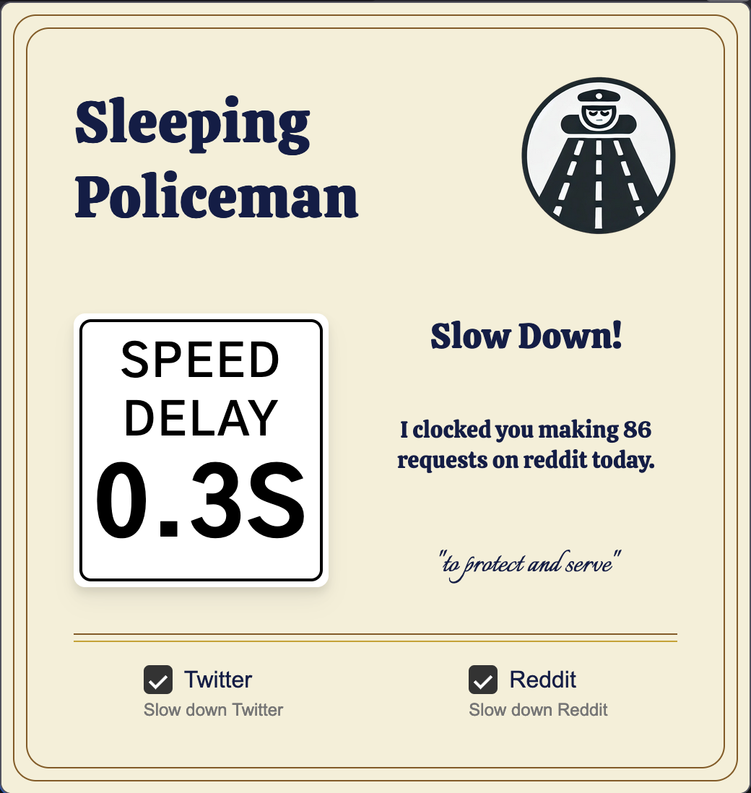

<br />
<div align="center">
  <a href="https://github.com/elijahrogers/sleeping_policeman">
    
  </a>

<h3 align="center">Sleeping Policeman</h3>
  <p align="center">
    Slow down! Sleeping Policeman will slow down the infinite scroll of Twitter and Reddit based on your usage every day.
    <br />
    <br />
    <a href="https://addons.mozilla.org/en-US/firefox/addon/sleeping-policeman/">Download for Firefox</a>
    ·
    <a href="https://github.com/elijahrogers/sleeping_policeman/issues/new?labels=bug&template=bug-report---.md">Report Bug</a>
    ·
    <a href="https://github.com/elijahrogers/sleeping_policeman/issues/new?labels=enhancement&template=feature-request---.md">Request Feature</a>
  </p>
</div>


## Getting Started



The easiest way to use Sleeping Policeman is to download the extension directly from Mozilla via <a href="https://addons.mozilla.org/en-US/firefox/addon/sleeping-policeman/">addons.mozilla.org</a> (AMO). It can also be run as a temporary add-on locally using the instructions below.

<br clear="left"/>


## Installation

This will allow you to load the extension as a temporary add-on for local debugging. It requires `yarn` to build JS using [parcel](https://parceljs.org/).

1. Clone this repo: `git clone https://github.com/elijahrogers/sleeping_policeman.git`
2. Install packages and build: `yarn install && yarn watch`
4. Navigate to `about:debugging`in Firefox
5. Click "This Firefox"
6. Click "Load Temporary Add-on"
7. Open the extension's directory and select the `manifest.json` file

## Usage

When the appropriate checkbox for Reddit or Twitter is checked Sleeping Policeman will automatically count requests and add a delay to any `GET` requests based on the following formula:

```javascript
  Math.sqrt(Math.floor(currentRequestCount(site) / 50)) * 250
```

The delay increases sublinearly:

|Number of requests|Delay|
|---|---|
|0|0ms|
|50|250ms|
|100|~354ms|
|500|~790ms|
|1000|~1.1s|

The request count is reset each day and unchecking the checkbox will disable the delay.

## License

Distributed under the GNU GPL-3.0 License. See `LICENSE.txt` for more information.
